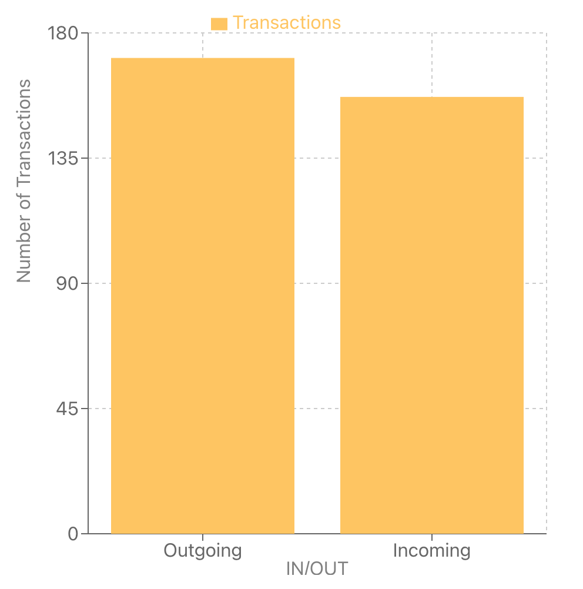
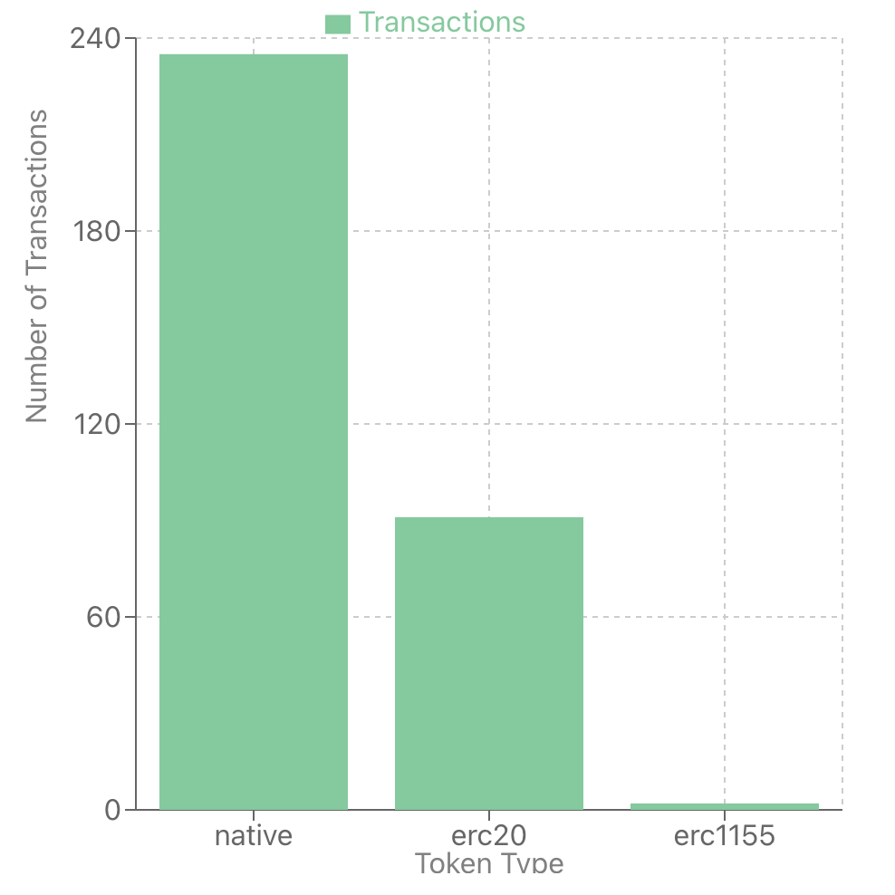
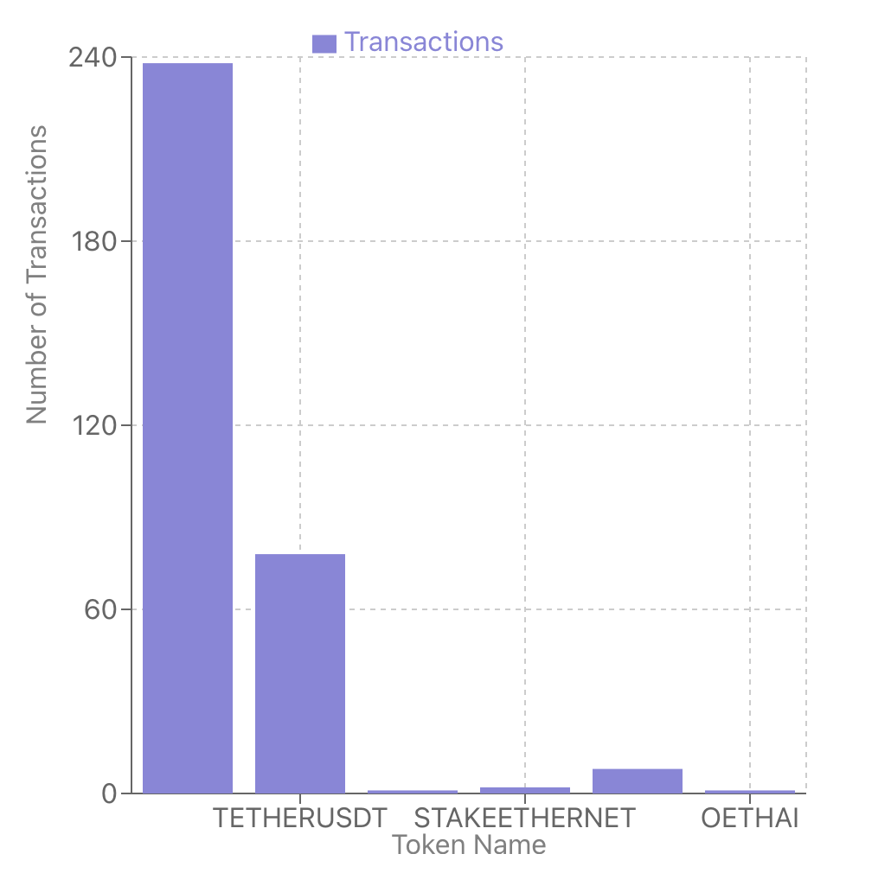
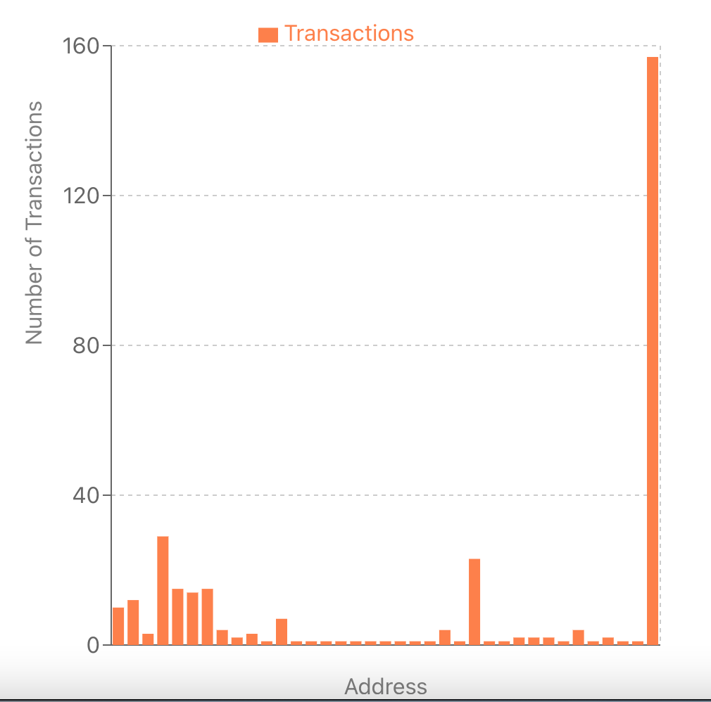
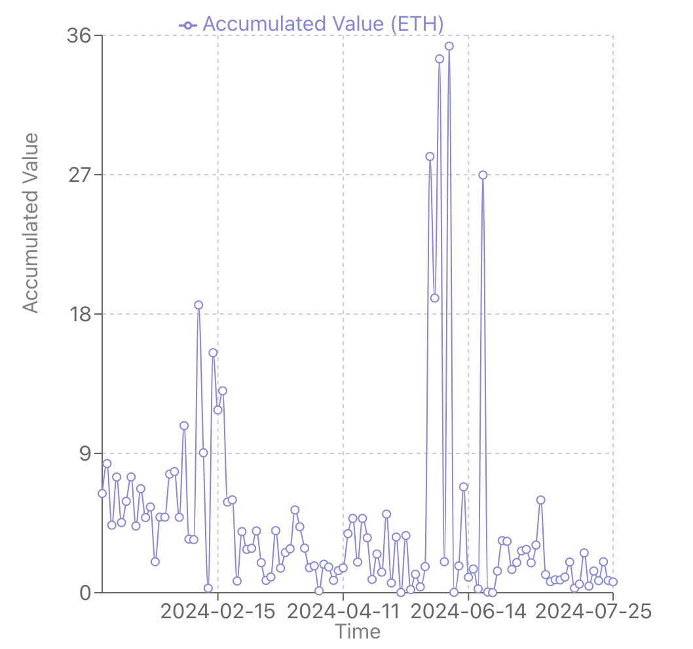
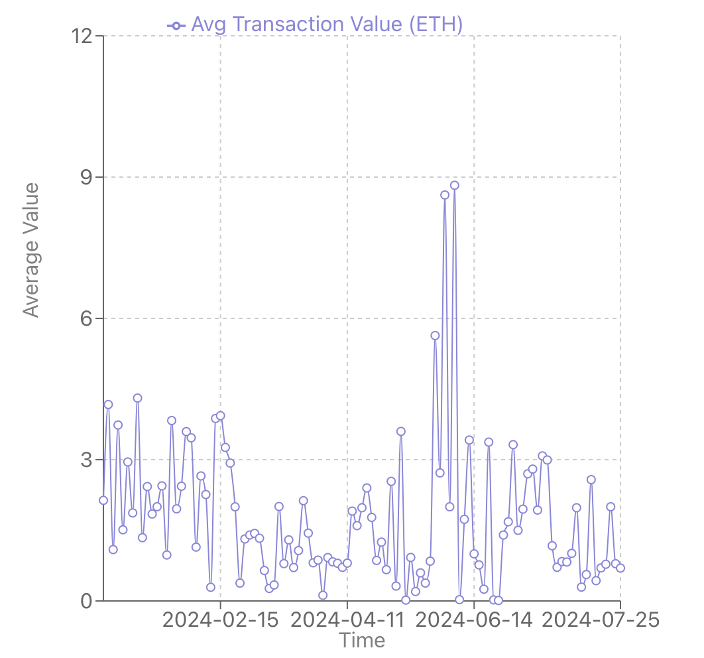
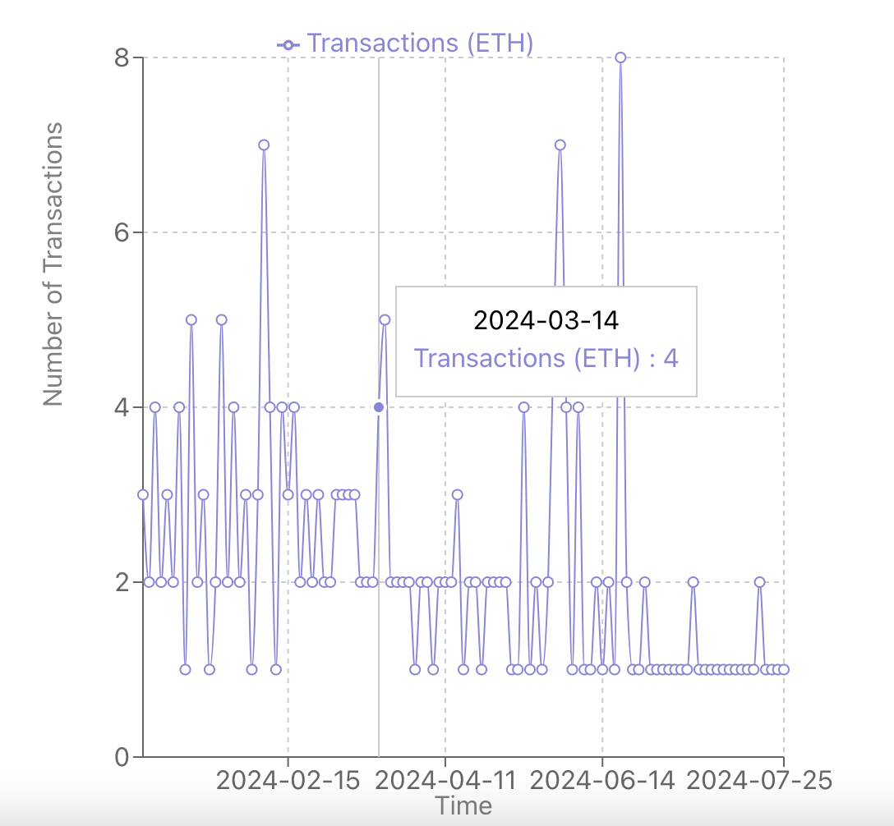
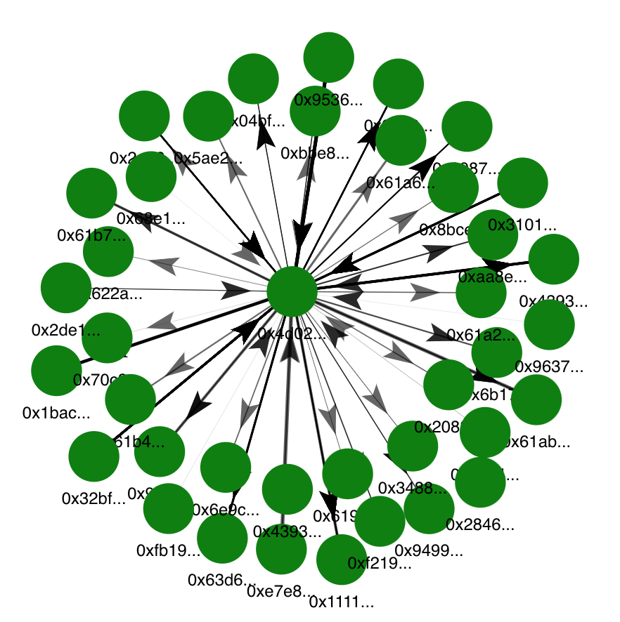

# react-chain-tx-charts

## Introduction

`react-chain-tx-charts` is a versatile React library designed for visualizing blockchain transaction data. By leveraging Alchemy's API, this library provides a simple way to fetch and display blockchain transaction details using a variety of chart types, such as bar charts, directed graphs, and more. It's an ideal tool for developers looking to integrate blockchain data visualization into their React applications.

## Installation

To install `react-chain-tx-charts`, you can use either npm or yarn, depending on your package manager of choice.

Using npm:

```bash
npm install react-chain-tx-charts
```

using yarn:

```bash
yarn add react-chain-tx-charts
```

## Documentation

### `useTransactionData` Hook

The `useTransactionData` hook is a powerful utility for fetching Ethereum transactions associated with a given address. It uses the Alchemy API to retrieve transaction data and allows filtering through various options such as date range, token types, transaction categories, and more.

#### Hook Signature

```javascript
function useTransactionData(alchemyApiKey: string): {
  data: Transaction[];
  loading: boolean;
  error: string | null;
  fetch: (options: FetchOptions, address: string) => void;
}
```

#### Parameters

`alchemyApiKey`: Your Alchemy API key to access Ethereum data.
`options`: An object that allows you to filter the transactions based on various criteria (explained below).
`address`: The Ethereum address for which you want to fetch the transactions.

#### Return Values

`data`: An array of transactions that match the given address and filters.
`loading`: A boolean indicating whether the data is currently being fetched.
`error`: A string containing an error message if the fetch fails, or null if there's no error.
`fetch`: A function to trigger the data fetch with the provided options and address.

#### Fetch Options

The FetchOptions object allows you to customize the data retrieval process. Here are the available filters:

- `startTime` (optional): The start time (in ISO 8601 format) for the transactions to fetch.
- `endTime` (optional): The end time (in ISO 8601 format) for the transactions to fetch.
- `maxNumber` (optional): The maximum number of transactions to retrieve.
- `tokenAddresses` (optional): An array of specific token contract addresses to filter transactions.
- `transactionType` (optional): The type of transactions to fetch. Possible values are:

  - `external`: External transactions (ETH transfers).
  - `erc20`: ERC-20 token transfers.
  - `erc721`: ERC-721 token transfers (NFTs).
  - `erc1155`: ERC-1155 token transfers.

- `direction` (optional): The direction of transactions to filter. Possible values are:
  - `incoming`: Transactions where the given address is the recipient.
  - `outgoing`: Transactions where the given address is the sender.
- `counterpartyAddress` (optional): A specific address to filter transactions against.
- `tokenType` (optional): The type of tokens to filter. Possible values are:
  - `fungible`: Fungible tokens like ERC-20.
  - `non-fungible`: Non-fungible tokens like ERC-721 or ERC-1155.

### Chart Components

#### `TransactionsInOut`

The `TransactionsInOut` component is a React component that displays a **_ bar chart _** representing the number of input and output transactions associated with a given address. This visualization helps in quickly understanding the transaction flow to and from a specific address over time.

**Props**

- transactions: Transaction[] (required)
  - An array of transaction objects containing the details of each transaction, such as the sender, recipient, amount, and token involved. The transaction object should follow this structure. This is the same structure of data `useTransactionData` hook returns.

```javascript
interface Transaction {
  from: string;
  to: string;
  value: string;
  token: string;
  category: string;
  time: Date | null;
}
```

- inputAddress: string (required)

  - The address for which the transactions are being analyzed. The chart will use this address to differentiate between incoming and outgoing transactions.

- width: number (optional, default: 800)

  - The width of the chart in pixels. Adjust this value based on the container size or the layout of your application.

- height: number (optional, default: 600)
  - The height of the chart in pixels. Adjust this value based on the container size or the layout of your application.

```HTML
  <TransactionsInOut transactions={data} inputAddress={address} width={500} height={500} />
```



#### `TransactionsByType`

The `TransactionsByType` component is a React component that displays a bar chart representing the number of transactions by type. This visualization helps in understanding the distribution of different transaction types (e.g., external: usual ETH transactions, ERC-20, ERC-721, ERC-1155) within a given dataset.

**Props**

- transactions: Transaction[] (required)

- width: number (optional, default: 800)

- height: number (optional, default: 600)

```HTML
  <TransactionsByType transactions={data} width={500} height={500} />
```



#### `TransactionsByToken`

The `TransactionsByToken` component is a React component that displays a bar chart representing the number of transactions for each token. This chart helps visualize the activity level associated with different tokens within the provided transaction dataset.

**Props**

- transactions: Transaction[] (required)

- width: number (optional, default: 800)

- height: number (optional, default: 600)

```HTML
  <TransactionsByToken transactions={data} width={500} height={500} />
```



#### `TransactionsByAddress`

The `TransactionsByAddress` component is a React component that displays a bar chart representing the number of transactions between a specific input address and other addresses. This chart helps visualize the interaction level of the given address with different addresses within the provided transaction dataset.

**Props**

- inputAddress: string (required)

- transactions: Transaction[] (required)

- width: number (optional, default: 800)

- height: number (optional, default: 600)

```HTML
  <TransactionsByAddress transactions={data} width={500} height={500} inputAddress={address} />
```



#### `AccumulatedValueOverTime`

The `AccumulatedValueOverTime` component is a React component that displays a line chart representing the accumulated value of transactions for a given token over time. This chart helps visualize how the value of transactions involving a specific token builds up over a chosen time interval.

**Props**

- transactions: Transaction[] (required)

- width: number (optional, default: 800)

- height: number (optional, default: 600)

- token: string (required)

  - The token name for which the accumulated value is being calculated. Only transactions involving this token will be included in the chart.

- timeSlot: 'minutely' | 'hourly' | 'daily' | 'weekly' | 'monthly' (required)
  - The time interval over which the accumulated value is calculated and displayed. This determines the granularity of the time axis on the chart.

```HTML
  <AccumulatedValueOverTime timeSlot="daily" transactions={data} token="ETH" width={500} height={500} />
```



#### `AvgTransactionValueOverTime`

The `AvgTransactionValueOverTime` component is a React component that displays a line chart representing the average value of transactions for a given token over time. This chart helps visualize how the average transaction value for a specific token changes over a selected time interval.

**Props**

- transactions: Transaction[] (required)

- width: number (optional, default: 800)

- height: number (optional, default: 600)

- token: string (required)

- timeSlot: 'minutely' | 'hourly' | 'daily' | 'weekly' | 'monthly' (required)

```HTML
  <AvgTransactionValueOverTime timeSlot="daily" transactions={data} token="ETH" width={500} height={500} />
```



#### `TransactionsOverTime`

The `TransactionsOverTime` component is a React component that displays a line chart representing the number of transactions for a given token over time. This chart provides insights into the frequency of transactions involving a specific token across selected time intervals.

**Props**

- transactions: Transaction[] (required)

- width: number (optional, default: 800)

- height: number (optional, default: 600)

- token: string (optinal): if dont send token it shows transactions for all tokens.

- timeSlot: 'minutely' | 'hourly' | 'daily' | 'weekly' | 'monthly' (required)

```HTML
  <TransactionsOverTime timeSlot="daily" transactions={data} token="ETH" width={500} height={500} />
```



#### `DirectedGraph`

The `DirectedGraph` component is a React functional component that visualizes transactions as a directed graph. In this graph, each node represents an address, and each edge represents a transaction between two addresses. The thickness of the edges reflects the value of the transactions.

**Props**

- transactions: Transaction[] (required)

- width: number (optional, default: 800)

- height: number (optional, default: 600)

- token: string (required)

```HTML
  <DirectedGraph transactions={data} token="ETH" width={500} height={500} />
```



## Complete example

```javascript
import {
  useTransactionData,
  TransactionsByAddress,
  TransactionsByToken,
  TransactionsByType,
  TransactionsInOut,
  DirectedGraph,
  AccumulatedValueOverTime,
  AvgTransactionValueOverTime,
  TransactionsOverTime
  } from "react-chain-tx-charts"

function App() {
  let address = desiredAddress;
  let alchemyApiKey = process.env.REACT_APP_ALCHEMY;
  const { data, loading, error, fetch } = useTransactionData(address);

  return (
    <div className="App">
      <button
        onClick={() => {
          fetch(options:{}, alchemyApiKey);
        }}
      >
        Fetch Transactions
      </button>
      {loading && <p>Loading...</p>}

      {error && <p>Error loading transactions</p>}

      {data.length != 0 && (
        <div style={{ display: 'flex', justifyContent: 'center' }}>
          <DirectedGraph transactions={data} token="ETH" alchemyApiKey={alchemyApiKey} width={500} height={500} />
        </div>
      )}

      {data.length != 0 && (
        <div style={{ display: 'flex', justifyContent: 'center' }}>
          <TransactionsOverTime timeSlot="daily" transactions={data} token="ETH" width={500} height={500} />
        </div>
      )}

      {data.length != 0 && (
        <div style={{ display: 'flex', justifyContent: 'center' }}>
          <AvgTransactionValueOverTime timeSlot="daily" transactions={data} token="ETH" width={500} height={500} />
        </div>
      )}

      {data.length != 0 && (
        <div style={{ display: 'flex', justifyContent: 'center' }}>
          <AccumulatedValueOverTime timeSlot="daily" transactions={data} token="ETH" width={500} height={500} />
        </div>
      )}

      {data.length != 0 && (
        <div style={{ display: 'flex', justifyContent: 'center' }}>
          <TransactionsInOut transactions={data} inputAddress={address} width={500} height={500} />
        </div>
      )}

      {data.length != 0 && (
        <div style={{ display: 'flex', justifyContent: 'center' }}>
          <TransactionsByType transactions={data} width={500} height={500} />
        </div>
      )}
      {data.length != 0 && (
        <div style={{ display: 'flex', justifyContent: 'center' }}>
          <TransactionsByToken transactions={data} width={500} height={500} />
        </div>
      )}

      {data.length != 0 && (
        <div style={{ display: 'flex', justifyContent: 'center' }}>
          <TransactionsByAddress transactions={data} width={500} height={500} inputAddress={address} />
        </div>
      )}
    </div>
  );
}

export default App;
```
